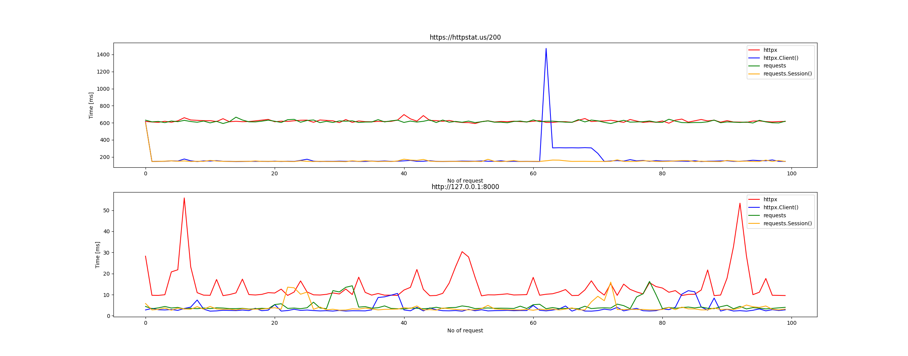
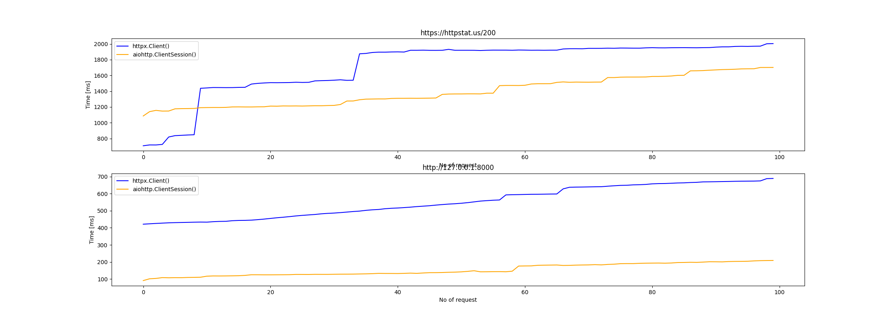

# Fetching libs

This is a simple research write up on three major python packages used for sending http requests: `requests`, `httpx` and `aiohttp`.

## Short description of packages

### `requests`

https://docs.python-requests.org/en/latest/

Library that is well known and is used in most projects which require http client. Requsts can be sent only in sync fashion. 10+ years on the market.

### `httpx`

https://www.python-httpx.org/

[_This is a new kid on the block_](https://www.confessionsofadataguy.com/httpx-vs-requests-in-python-performance-and-other-musings/). `httpx` can be used in async and sync fashion. 3+ years on the market.

### `aiohttp`

https://docs.aiohttp.org/en/stable/index.html

This package can be used only in async mode. 8+ years on the market.

## Test description

### Assumptions
- requests will be sent in sync and async way (whichever possible)
- targeted are two servers:
  - server that is spinned out locally
  - https://httpstat.us - cool service that let's you tets all sorts of http status codes and connection timeouts
- python version 3.10

### Local Server

[Minimal](https://fastapi.tiangolo.com/#create-it) required setup for FastAPI is used, only one enpoint and nothing more.

### Sync Test

Variation of this code was used to execute synchrounous requsts.

```python
def make_httpx_call(url: str):
    print(f"start httpx {url}")
    results = []
    for _ in range(REPEATS):
        t1 = timer()
        r = httpx.get(url)
        t2 = timer()
        secs = t2 - t1
        results.append(secs*1000)
        print(f"req: {_}")
        sleep(0.1)
    print("finished https")
    return results
```

For exact code look in to `sync_test.py`. 
As you can see between two calls there was a 100ms break to prevent fro DDOSing servers.

#### Results



As you can see sending requests to https://httpstat.us through Clients are almost as efficient in both cases. Same for both packages when creating new connection every time. Worth noticing is that using clients is almost 4 to 5 times more efficient compering to new connections (avg 800ms vs 150-200ms). I'm skipping this spike since it looks just weird and is probably caused by some kind of server throthling.

As for local requests, results can be considered very much efficient since max response time is 60ms tops. In this case it's worth to mention that only making direct requests through `httpx` were much slower. Other ways of sending requsts were acting similarly and all of them have experienced minor hickups. What is interesting and would require further investigation, is that this hickups happend sequentialy two times (20 to 40 request and 70 to 90) in exact same order.

### Async tests

Variation of this code was used to execute asynchrounous requsts.

```python
async def make_aiohttp_client_session_call(url: str):
    print(f"aio> start aiohttp session {url}")
    results = []
    async with aiohttp.ClientSession() as session:
        async def send_request(idx, res, ses):
            t1 = time.monotonic()
            async with ses.get(url) as response:
                pass
            t2 = time.monotonic()
            secs = t2 - t1
            res.append(secs*1000)
            print(f"aio> req: {idx} {secs}")

        await asyncio.gather(*[send_request(_, results, session) for _ in range(REPEATS)])

    print("aio> finished aiohttp session")
    return results
```

For exact code look in to `async_test.py`. 

#### Results



I have a hard time interpretting this. One thing I am sure - I don't know how to properly measure execution time of async functions. So I can only try to interpret what I see on the chart. 

Looks like all the measurements started at (almost) the same time - this would explain why there are no ups and downs and the line is only going up. Places where the line is spiking looks like local resource being busy - but I'm not sure what this is.

Worth noticing is that sending 100 requests took around 2s in total for httstat.us and 700ms for localhost, whereas `aiohttp.ClientSession` acted significantly better outperforming `httpx.AsyncClient` 4 times.


## Conclusion - which to use?

Based on the results in order of recomendation:
1. `aiohttp.ClientSession`
2. `httpx.AsyncClient`
3. `requests.Session`
4. `httpx.Client`
5. `requests.<method>`
6. `httpx.<method>`

Be aware that badly done async function will not be as efficient as you would expect. There is a huge overhead that you need to know beforehand. If you don't know this stuff - learn - nothing will replace that.

For most projects good ol' `requests` will be sufficient enough, not to mention when used with `requests.Session`.

## Project Trade-offs

Here is a thing. When working on a project we try to keep our dependencies as small as possible. It's obvious that it's better to write your own code than install package that only changes DB connection string to Django DB Configuration (I'm looking at you dj-database-url). 

In your project you might find yourself in a situation when you sometimes need to use async and sync requests and it looks like httpx that provides both functionalities is a perfect fit (requests - only sync, aiohttp - only async). But I kind of proved today that `the cow that moos a lot gives not that much milk`. 

Now to trade-offs and you can only pick one:
- be as efficient as possible - use `requests` and `aiohttp` in conjunction
- have less dependencies - use `httpx`

Juding by my experience (which is rather small) I'd say you should always go with `requests` and `aiohttp`. Chances are:
- you don't need async at all - so part of `httpx` would be used at all
- you only use async - so part of `httpx` would be used at all
- you use both - great! But you need to create different clients/services/functions/methods anyway to handle sync/async requests and this parts are not interchangeable, so why reject the most efficient solution? `¯\_(ツ)_/¯`

## I actually like `httpx`

I had a chance to work with `httpx.Client` a little and I liked the way you can build auth flows or build requests objects and reuse them instead of creating them every time. But that's for the other time. If you're interested in that checkout [advanced useage](https://www.python-httpx.org/advanced/).

#### Other resources

https://developpaper.com/requests-aiohttp-httpx-comparison/

https://www.confessionsofadataguy.com/httpx-vs-requests-in-python-performance-and-other-musings/

https://www.reddit.com/r/Python/comments/l3cbbo/httpx_vs_requests_in_python_performance_and_other/

